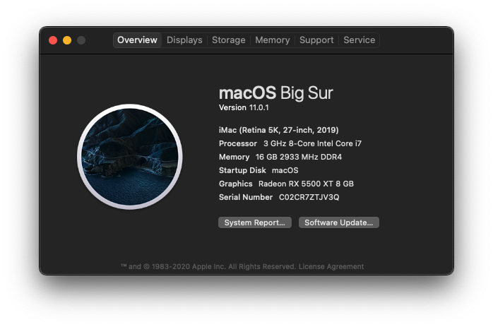

### Hardware
Main: Asus ROG Strix Z390-H Gaming 
CPU: Intel Core i7 9700 
RAM: Ram PC Corsair Vengeance RGB Pro 16GB 3000Mhz DDR4 (2x8GB) CMW16GX4M2D3000C16 
GPU: Gigabyte RX55XTGAMING OC - 8GB (RX5500XT)  
SSD: SSD Samsung 970 EVO Plus PCIe NVMe V-NAND M.2 2280 250GB MZ-V7S250BW 

### OpenCore
Version: 0.5.9

### MacOS
10.15.5

### What's Working
- :white_check_mark: Display
- :white_check_mark: Ethernet
- :white_check_mark: Sleep/Wake
- :white_check_mark: USB ports
- :white_check_mark: Audio

### BIOS setting
See [Intel BIOS settings](https://dortania.github.io/OpenCore-Desktop-Guide/config.plist/coffee-lake.html#intel-bios-settings)

### Images

### Tools

1. GenSMBIOS
[Link](https://github.com/corpnewt/GenSMBIOS)

2. ProperTree
[Link](https://github.com/corpnewt/ProperTree)

3. MountEFI
[Link](https://github.com/corpnewt/MountEFI)

4. Hackintool
[Link](https://github.com/headkaze/Hackintool/releases)

### Guide & Tutorial

- USB mapping: 

